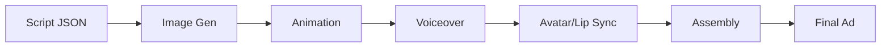

# AI Video Generation API Comparison

Deep analysis for ClipFactory — automated UGC ad clip production at scale.

---

## Quick Verdict

| Platform | Doc Quality | Cost/5s clip | Best For | AI-Friendly |
|----------|:-----------:|:------------:|----------|:-----------:|
| **fal.ai** | ⭐⭐⭐⭐⭐ | $0.25–0.35 | Aggregator — one API for everything | ⭐⭐⭐⭐⭐ |
| **Runway ML** | ⭐⭐⭐⭐⭐ | $0.25–0.75 | Premium cinematic quality | ⭐⭐⭐⭐⭐ |
| **Kling AI** | ⭐⭐⭐ | $0.35–1.00 | Best human motion/faces | ⭐⭐⭐ |
| **Luma AI** | ⭐⭐⭐⭐ | $0.35 | Artistic/dreamy style | ⭐⭐⭐⭐ |

> [!TIP]
> **Recommendation: Start with fal.ai** — it gives you access to Kling, Luma, AND ElevenLabs voices through one API key. Then add Runway as a premium option if quality demands it.

---

## 1. Runway ML

### Documentation Rating: ⭐⭐⭐⭐⭐ (Best-in-class)

**Why it scores highest:**
- Official Python SDK (`pip install runwayml`) with clean, typed API
- Copy-paste code examples in Python, Node.js, and cURL
- `waitForTaskOutput()` built into SDK — no manual polling needed
- Base64 image upload support (no external hosting needed)
- Playground for testing before writing code
- Clear error handling with `TaskFailedError`

**Code sample (actual from docs):**
```python
from runwayml import RunwayML, TaskFailedError

client = RunwayML()
task = client.image_to_video.create(
    model='gen4.5',
    prompt_image='https://example.com/image.jpg',
    prompt_text='A timelapse on a sunny day',
    ratio='1280:720',
    duration=5,
).wait_for_task_output()
print('Video URL:', task.output[0])
```

### Pricing

| Model | Credits/sec | Cost/sec | 5s clip | 10s clip |
|-------|:-----------:|:--------:|:-------:|:--------:|
| Gen-4 Turbo | 5 | $0.05 | **$0.25** | $0.50 |
| Gen-4.5 | 12 | $0.12 | **$0.60** | $1.20 |
| Gen-4 Aleph | 15 | $0.15 | **$0.75** | $1.50 |

- 1 credit = $0.01
- Usage tiers with concurrency limits (Tier 1: 2 concurrent, Tier 3: 5 concurrent)
- No subscription required — pure pay-per-use via API

### Features

| Feature | Supported |
|---------|:---------:|
| Image-to-video | ✅ |
| Text-to-video | ✅ |
| Image generation | ✅ |
| Custom aspect ratios | ✅ (1280:720, 720:1280, etc.) |
| Duration control | ✅ (5s, 10s) |
| Camera motion control | ❌ |
| Lip sync / talking head | ❌ |
| Voice generation | ❌ |
| UGC avatars | ❌ |
| Batch processing | ✅ (via concurrent tasks) |
| Webhook callbacks | ✅ |

### Strengths
- 🏆 Best documentation — AI can integrate this in minutes
- 🏆 Official SDK with built-in task waiting
- 🏆 Gen-4 Turbo is incredibly cost-effective ($0.25/clip)
- 🏆 Battle-tested at enterprise scale (millions of videos generated)

### Weaknesses
- ❌ No voice/avatar features — video only
- ❌ No camera motion control
- ❌ Gen-4.5/Aleph are expensive for bulk use

---

## 2. fal.ai

### Documentation Rating: ⭐⭐⭐⭐⭐ (Best for automation)

**Why it scores highest:**
- **600+ models** through one API — video, image, voice, audio
- Python client (`pip install fal-client`) with simple `subscribe()` pattern
- MCP server available (connect to Cursor/IDE)
- All models use same interface — switch models without code changes
- Pay-per-use, no subscription required

**Code sample:**
```python
import fal_client

result = fal_client.subscribe(
    "fal-ai/kling-video/v2.1/standard/image-to-video",
    arguments={
        "image_url": "https://example.com/image.jpg",
        "prompt": "Gentle camera zoom in, natural movement",
        "duration": "5",
        "aspect_ratio": "9:16",
    }
)
video_url = result["video"]["url"]
```

### Pricing (Video Models)

| Model | Cost/sec | 5s clip | Notes |
|-------|:--------:|:-------:|-------|
| Kling 2.5 Turbo | $0.07 | **$0.35** | Best value via fal |
| Kling 2.1 Standard | $0.07 | **$0.35** | Reliable |
| Stable Video | flat | **$0.075** | Cheapest overall |
| Luma Dream Machine | ~$0.10 | **~$0.50** | Cinematic |
| Minimax Hailuo | varies | ~$0.30 | Fast |
| Google Veo 3 | $0.40 | **$2.00** | Highest quality |

### Pricing (Voice/Audio Models)

| Model | Cost | Notes |
|-------|:----:|-------|
| ElevenLabs TTS (via fal) | ~$0.01–0.03/request | All ElevenLabs models available |
| Audio Isolation | per request | Clean up noisy audio |
| Sound Effects | per request | Generate SFX |

### Features

| Feature | Supported |
|---------|:---------:|
| Image-to-video | ✅ (multiple models) |
| Text-to-video | ✅ |
| Image generation | ✅ (Flux, SDXL, etc.) |
| Voice generation | ✅ (ElevenLabs suite) |
| Sound effects | ✅ |
| Music generation | ✅ |
| UGC avatars | ❌ (no direct avatar API) |
| Lip sync | ⚠️ (via specific models) |
| Batch processing | ✅ |
| Webhook callbacks | ✅ |
| File upload | ✅ (`fal_client.upload_file()`) |

### Strengths
- 🏆 **One API for EVERYTHING** — video, voice, images, audio
- 🏆 Access to Kling, Luma, ElevenLabs, and more through single key
- 🏆 Cheapest way to use Kling ($0.07/sec via fal vs higher direct)
- 🏆 No subscription — pure pay-per-use
- 🏆 Fastest inference (they claim 10x faster than alternatives)
- 🏆 SOC 2 compliant

### Weaknesses
- ❌ Third-party wrapper — occasionally lags behind native APIs
- ❌ No built-in UGC avatar system
- ❌ Model availability depends on fal's partnerships

---

## 3. Kling AI (Direct)

### Documentation Rating: ⭐⭐⭐ (Adequate but friction-heavy)

**Why it scores lower:**
- Docs hosted on klingai.com — JS-rendered, hard for AI to scrape
- No official Python SDK — REST API only
- Credit-based pricing is confusing (different credit costs per model)
- Originally Chinese platform, some docs are translated
- JWT token authentication (more complex than API key)
- Multiple third-party wrappers (kie.ai, piapi.ai, pollo.ai) with better docs than official

**Code sample (REST API):**
```python
import requests

headers = {
    "Authorization": "Bearer YOUR_JWT_TOKEN",
    "Content-Type": "application/json"
}

response = requests.post(
    "https://api.klingai.com/v1/videos/image2video",
    headers=headers,
    json={
        "image_url": "https://example.com/image.jpg",
        "prompt": "Gentle camera zoom in",
        "duration": 5,
        "mode": "standard",
        "aspect_ratio": "9:16"
    }
)
task_id = response.json()["task_id"]
# Then poll for completion...
```

### Pricing (Direct API)

| Model | Credits/sec | Cost/sec | 5s clip | Notes |
|-------|:-----------:|:--------:|:-------:|-------|
| Kling 2.6 (720p) | 6 | $0.03 | **$0.15** | Motion control |
| Kling 2.6 (1080p) | 9 | $0.045 | **$0.225** | Motion control |
| Kling 3.0 Standard | 20 | $0.10 | **$0.50** | No audio |
| Kling 3.0 Standard+Audio | 30 | $0.15 | **$0.75** | With audio |
| Kling 3.0 Pro | 27 | $0.135 | **$0.675** | Higher quality |

**Subscription plans:** Free (66 credits/day) → Standard ($6.99/mo, 660 credits) → Pro ($25.99/mo, 3K credits) → Premier ($64.99/mo, 8K credits) → Ultra ($127.99/mo, 26K credits)

### Features

| Feature | Supported |
|---------|:---------:|
| Image-to-video | ✅ |
| Text-to-video | ✅ |
| Camera motion control | ✅ (Kling 2.6+) |
| Keyframe editing | ✅ |
| Multi-shot storytelling | ✅ (Kling 3.0) |
| Native audio generation | ✅ (Kling 3.0) |
| Lip sync | ✅ |
| Video extend | ✅ |
| UGC avatars | ❌ |
| Voice generation | ❌ |

### Strengths
- 🏆 **Best human motion physics** — faces, bodies, subtle movement
- 🏆 Camera motion control (pan, zoom, orbit)
- 🏆 Native audio generation
- 🏆 Lip sync capabilities
- 🏆 Keyframe editing for precise control
- 🏆 Free tier for testing

### Weaknesses
- ❌ Worst documentation for AI integration
- ❌ No official SDK — manual REST + polling
- ❌ JWT authentication adds complexity
- ❌ Credit system is confusing
- ❌ Better accessed through fal.ai wrapper

---

## 4. Luma AI (Dream Machine)

### Documentation Rating: ⭐⭐⭐⭐ (Clean but minimal)

**Why:**
- Official Python SDK (`pip install lumaai`)
- Clean REST API with clear endpoints
- Good getting-started guide
- Supports both image and video generation
- But: fewer models, fewer parameters, less control

**Code sample:**
```python
from lumaai import LumaAI

client = LumaAI(auth_token="your-key")

generation = client.generations.create(
    prompt="Gentle camera zoom in on a woman with glasses",
    keyframes={
        "frame0": {
            "type": "image",
            "url": "https://example.com/image.jpg"
        }
    }
)
# Poll for completion
```

### Pricing

| Plan | Cost | Credits | Per 5s Video |
|------|:----:|:-------:|:------------:|
| API (per frame) | $0.0032/frame | — | **~$0.35** (24fps) |
| Lite (web) | $9.99/mo | 3,200 | ~$0.31 |
| Plus (web) | $29.99/mo | 10,000 | ~$0.30 |
| Unlimited (web) | $94.99/mo | ∞ (relaxed) | ~$0.24 |

### Features

| Feature | Supported |
|---------|:---------:|
| Image-to-video | ✅ |
| Text-to-video | ✅ |
| Image generation | ✅ |
| Character reference | ✅ |
| Style reference | ✅ |
| Image-to-image | ✅ |
| Camera control | ⚠️ (via prompts) |
| Voice/audio | ❌ |
| UGC avatars | ❌ |

### Strengths
- 🏆 Most artistic/cinematic output style
- 🏆 Character reference for consistency
- 🏆 Style reference for brand consistency
- 🏆 Clean Python SDK

### Weaknesses
- ❌ No voice, avatar, or audio features
- ❌ Less precise motion control than Kling
- ❌ Fewer model options
- ❌ Web platform credits don't transfer to API

---

## Voice & Voiceover APIs

### ElevenLabs ⭐ (Industry Leader)

| Feature | Detail |
|---------|--------|
| Quality | Best-in-class, "scarily realistic" |
| Languages | 32+ including Finnish |
| Voice cloning | ✅ (create consistent brand voices) |
| Finnish support | ✅ |
| API | REST + Python SDK |
| Pricing | Free tier → Starter $5/mo → Creator $22/mo → Pro $99/mo |
| Cost per char | ~$0.06–0.30 per 1K characters (varies by plan) |
| Latency | 75ms (Flash model) |

**Why ElevenLabs for your use case:**
- Finnish language support is critical for Banaani ads
- Voice cloning = same UGC voice across all ads
- Available directly AND through fal.ai

**Code sample:**
```python
from elevenlabs import ElevenLabs

client = ElevenLabs(api_key="your-key")

audio = client.text_to_speech.convert(
    text="Tiesitkö, että optikkoliikkeessä monitehot maksaa 600–800 euroa?",
    voice_id="finnish-woman-voice-id",
    model_id="eleven_multilingual_v2"
)
# Save audio to file
```

---

## UGC Avatar / Talking Head APIs

### HeyGen ⭐ (Best for UGC Ads)

| Feature | Detail |
|---------|--------|
| Avatar quality | Avatar IV — most realistic |
| Digital twins | ✅ (clone real person) |
| Lip sync | ✅ (native) |
| Languages | 40+ |
| API pricing | Free (10 credits) → Pro $99/mo (100 credits) → Scale $330/mo (660 credits) |
| Cost per video | ~$0.50–0.99/credit |
| Photo-to-video | ✅ |
| Product placement | ✅ |

**Why HeyGen for your use case:**
- Avatar IV creates the most realistic talking heads
- Digital twin = clone your own UGC creator
- Photo-to-video = turn any stock photo into talking avatar
- REST API for automation

### Synthesia (Enterprise Alternative)

| Feature | Detail |
|---------|--------|
| Focus | Corporate, training, formal |
| Avatars | 240+ stock, custom available |
| API access | Creator plan ($89/mo) or Enterprise |
| Languages | 160+ |
| Quality | Professional, polished |
| Best for | Corporate content, not UGC-style |

> [!IMPORTANT]
> **For UGC-style ad avatars, HeyGen >> Synthesia.** Synthesia avatars look too "corporate" for consumer ads. HeyGen's Avatar IV is more natural and UGC-feeling.

---

## Full Pipeline Comparison

What does it take to build the complete automated UGC ad pipeline?



### Option A: fal.ai + ElevenLabs + HeyGen (Recommended)

| Step | Tool | Cost | Notes |
|------|------|:----:|-------|
| Image generation | Nano Banana 2 (Gemini) | $0.07/img | Already built |
| Animation | fal.ai (Kling 2.5) | $0.35/5s | Already built |
| Voiceover | ElevenLabs (via fal.ai) | ~$0.02/voiceover | Same API key |
| UGC Avatar | HeyGen API | ~$0.50–1/video | Separate API |
| Assembly | FFmpeg (local) | Free | Already built |
| **Total per 5-scene ad** | | **~$3–5** | |

### Option B: Runway + ElevenLabs (Premium Quality)

| Step | Tool | Cost | Notes |
|------|------|:----:|-------|
| Image generation | Nano Banana 2 | $0.07/img | |
| Animation | Runway Gen-4 Turbo | $0.25/5s | Best cinematic |
| Voiceover | ElevenLabs direct | ~$0.02/voiceover | |
| UGC Avatar | HeyGen API | ~$0.50–1/video | |
| Assembly | FFmpeg (local) | Free | |
| **Total per 5-scene ad** | | **~$2–4** | |

### Option C: Full Automation (Dream Scenario)

If you want to skip separate tools and generate the ENTIRE talking-head video:

| Approach | Tool | What it does |
|----------|------|:-------------|
| Script → full video | **HeyGen API** | Write script → HeyGen generates avatar talking, product shots, everything |
| Script → voice+video | **ElevenLabs Studio** | Combined voice + image + video generation in one platform |
| Script → clips | **ClipFactory (ours)** | Image gen + animation + voice + assembly pipeline |

> [!NOTE]
> **Option C works best as a hybrid.** HeyGen generates the talking-head segments. ClipFactory generates the product shots and b-roll. FFmpeg stitches everything together. This is the most realistic "full automation" approach right now.

---

## Final Recommendation

### Immediate (This Week)

1. **Sign up for fal.ai** — single API key, pay-per-use, access to Kling + ElevenLabs
2. **Sign up for Google AI Studio** — free Nano Banana 2 image generation
3. **Test ClipFactory** with `--images-only` first, then full pipeline
4. **Cost to test:** <$5 for a complete 6-scene ad

### Short-term (This Month)

4. **Add ElevenLabs voiceover** to the pipeline (via fal.ai — no extra API key)
5. **Evaluate HeyGen** for talking-head avatar segments ($99/mo Pro plan)
6. **A/B test** Kling vs Runway Gen-4 Turbo quality on same images

### Medium-term (Q2)

7. **Hybrid pipeline:** ClipFactory for b-roll + HeyGen for talking heads → FFmpeg assembly
8. **Scale to all clients** — not just Banaani
9. **Editor UI** for non-technical team members

---

## API Key Summary

| Service | URL | Type | Cost to Start |
|---------|-----|:----:|:-------------:|
| Google AI Studio | [aistudio.google.com](https://aistudio.google.com) | Free tier | $0 |
| fal.ai | [fal.ai/dashboard](https://fal.ai/dashboard) | Pay-per-use | $0 (pay as you go) |
| Runway ML | [dev.runwayml.com](https://dev.runwayml.com) | Pay-per-use | $0 (pay as you go) |
| ElevenLabs | [elevenlabs.io](https://elevenlabs.io) | Free tier | $0 |
| HeyGen | [heygen.com](https://heygen.com) | Free (10 credits) | $0 → $99/mo |
| Kling AI | [klingai.com](https://klingai.com) | Free (66 credits/day) | $0 → $7/mo |
| Luma AI | [lumalabs.ai](https://lumalabs.ai) | Free tier | $0 |
